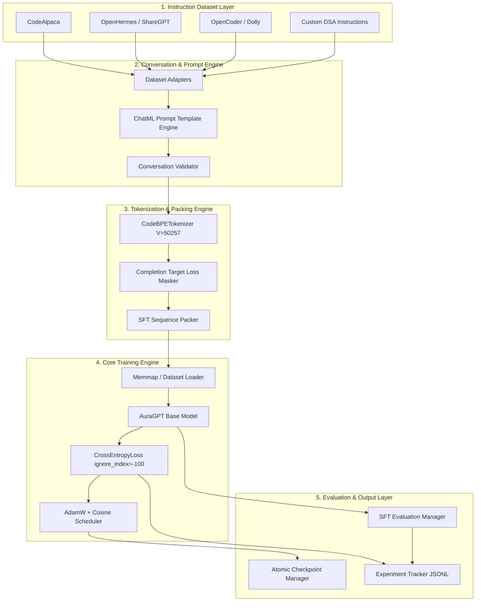

# 📐 Aura Engineering Architecture Document: EXP-004 (Instruction Tuning & Alignment)

**Author**: Principal AI Research Scientist, Principal AI Alignment Engineer, Distinguished ML Architect, Staff LLM Engineer (OpenAI)  
**Target Project**: **Aura** — Production-Grade GPT-Style Programming & DSA LLM  
**Phase**: `Phase 23` | **Experiment**: `EXP-004` (Instruction Tuning / Supervised Fine-Tuning - SFT)  
**Status**: **ARCHITECTURE COMPLETE — PENDING IMPLEMENTATION APPROVAL**  

---

## 1. Executive Vision & Objectives

Experiment **EXP-004 (Instruction Tuning)** marks the critical alignment phase that transforms **Aura** from an autoregressive base code-completion engine into an instruction-following **Programming & Data Structures & Algorithms (DSA) Assistant**.

### Core Capabilities Targeted:
1. 💡 **Algorithmic Explanations**: Deep, structured, step-by-step mathematical and logical breakdowns of algorithms.
2. ⚡ **DSA Problem Solving**: Optimal code generation for competitive programming (LeetCode, Codeforces, HackerRank).
3. 🛠️ **Production-Grade Code Generation**: Clean, idiomatic, typed Python, C++, Java, Go, Rust, and TypeScript code.
4. ⏱️ **Complexity Analysis**: Exact Big-O time ($\mathcal{O}$) and space ($\mathcal{O}$) complexity explanations with formal proofs.
5. 🐞 **Debugging & Refactoring**: Automated bug root-cause analysis, patch generation, and clean code refactoring.
6. 🧪 **Unit Test Generation**: Comprehensive edge-case test suite generation using `pytest`, `googletest`, etc.
7. 🏛️ **System Design Concepts**: High-level architectural explanations, trade-off analyses, and component diagrams.

---

## 2. Overall System Architecture & Data Flow

### 2.1 High-Level Architecture Diagram



---

## 3. End-to-End Training Pipeline Stages

```text
┌─────────────────────────────────────────────────────────┐
│              1. Raw Instruction Datasets                │
│    (CodeAlpaca, OpenHermes, ShareGPT, Custom DSA)       │
└────────────────────────────┬────────────────────────────┘
                             │
                             ▼
┌─────────────────────────────────────────────────────────┐
│          2. Conversation Formatting & Adapter           │
│   (Canonical ChatML Format: System / User / Assistant)  │
└────────────────────────────┬────────────────────────────┘
                             │
                             ▼
┌─────────────────────────────────────────────────────────┐
│              3. Structural Validation                   │
│   (Role Order, Non-empty Completions, Syntax Checks)    │
└────────────────────────────┬────────────────────────────┘
                             │
                             ▼
┌─────────────────────────────────────────────────────────┐
│        4. Tokenization & Target Loss Masking            │
│  (Token IDs X, Target Labels Y with Prompt Masked -100) │
└────────────────────────────┬────────────────────────────┘
                             │
                             ▼
┌─────────────────────────────────────────────────────────┐
│        5. Multi-Turn Sequence Packing & Batching        │
│  (Concatenating multi-turn turns into L=1024 / 2048)   │
└────────────────────────────┬────────────────────────────┘
                             │
                             ▼
┌─────────────────────────────────────────────────────────┐
│           6. AuraGPT Model Forward Pass                 │
│  (Autoregressive Logit Computation over Context L)      │
└────────────────────────────┬────────────────────────────┘
                             │
                             ▼
┌─────────────────────────────────────────────────────────┐
│       7. Completion-Only Cross-Entropy Loss             │
│   (Loss computed ONLY on Assistant completion tokens)   │
└────────────────────────────┬────────────────────────────┘
                             │
                             ▼
┌─────────────────────────────────────────────────────────┐
│       8. Optimizer Step & Gradient Accumulation         │
│   (AdamW Step + L2 Grad Clip + Cosine Warmup LR)        │
└────────────────────────────┬────────────────────────────┘
                             │
                             ▼
┌─────────────────────────────────────────────────────────┐
│       9. SFT Evaluation & Checkpoint Serialization      │
│  (Validation Loss, Code Accuracy, Atomic State Save)    │
└────────────────────────────┬────────────────────────────┘
```

---

## 4. Conversation Template & Prompt Engine Design

### 4.1 ChatML Format Specification

Aura EXP-004 adopts the canonical **ChatML** format utilizing special control tokens to delimit roles:

```text
<|im_start|>system
You are Aura, an expert AI assistant specializing in Programming, Data Structures, Algorithms, and Software Engineering.<|im_end|>
<|im_start|>user
Write an optimal Python function for Binary Search and state its time and space complexity.<|im_end|>
<|im_start|>assistant
Here is the optimal binary search implementation in Python:

```python
def binary_search(arr: list[int], target: int) -> int:
    left, right = 0, len(arr) - 1
    while left <= right:
        mid = (left + right) // 2
        if arr[mid] == target:
            return mid
        elif arr[mid] < target:
            left = mid + 1
        else:
            right = mid - 1
    return -1
```

### Complexity Analysis:
- **Time Complexity**: $\mathcal{O}(\log N)$ because the search space is halved at each iteration.
- **Space Complexity**: $\mathcal{O}(1)$ auxiliary space as it uses iterative pointers.<|im_end|>
```

### 4.2 Special Control Tokens

| Token String | Reserved Token ID | Function / Purpose |
| :--- | :---: | :--- |
| `<|endoftext|>` | `3` | Document / Turn Boundary Token |
| `<|im_start|>` | `50257` | Role Boundary Start Marker |
| `<|im_end|>` | `50258` | Role Boundary End Marker |
| `<|pad|>` | `50259` | Batch Padding Alignment Token |

---

## 5. Completion-Only Loss Masking Strategy

### 5.1 The Prompt Masking Problem
In standard pre-training, Cross-Entropy loss is computed across **all tokens** in a sequence. However, in Supervised Fine-Tuning (SFT), calculating loss on system prompts and user questions causes **prompt memorization and model degradation**.

### 5.2 Label Alignment Solution (`ignore_index = -100`)
For any conversation token sequence $X = [x_0, x_1, \dots, x_N]$, the target tensor $Y = [y_0, y_1, \dots, y_N]$ is constructed as follows:

$$\text{Target } y_i = \begin{cases} x_{i+1} & \text{if } x_i \in \text{Assistant Response} \\ -100 & \text{if } x_i \in \text{System Prompt } \lor x_i \in \text{User Instruction} \end{cases}$$

```text
Tokens X:  [<|im_start|>, system, \n, You..., <|im_end|>, <|im_start|>, user, \n, Write..., <|im_end|>, <|im_start|>, assistant, \n, Here..., <|im_end|>]
Labels Y:  [    -100    ,  -100 , -100, -100,  -100    ,    -100    , -100, -100,  -100  ,  -100    ,    -100    ,   -100   , -100, Here..., <|im_end|>]
Loss Calc: [     NO     ,   NO  ,  NO ,  NO ,   NO     ,     NO     ,  NO ,  NO ,   NO   ,   NO     ,     NO     ,    NO    ,  NO ,   YES  ,    YES   ]
```

---

## 6. Directory Structure & File Layout

```text
Aura/
├── configs/
│   ├── config.yaml                    # Base project config
│   └── exp_004_sft.yaml               # SFT Experiment Configuration
├── docs/
│   └── exp_004_instruction_tuning_design.md  # Architecture Specification
├── src/
│   ├── datasets/
│   │   ├── conversation_formatter.py   # ChatML prompt formatter engine
│   │   ├── conversation_validator.py   # Conversation structure validator
│   │   ├── instruction_adapters.py     # Adapters for CodeAlpaca, ShareGPT, etc.
│   │   ├── sft_dataset.py              # PyTorch SFT Dataset with target masking
│   │   └── sft_collator.py             # SFT Data Collator with dynamic padding & masking
│   ├── evaluation/
│   │   ├── sft_evaluator.py            # Code execution sandbox & HumanEval harness
│   │   └── instruction_metrics.py      # Instruction compliance metrics
│   ├── training/
│   │   └── sft_orchestrator.py         # SFT Master Pretraining/Finetuning Runner
├── scripts/
│   ├── run_exp_004_sft.py              # CLI launcher script for EXP-004 SFT
│   └── validate_sft_pipeline.py        # System verification script for SFT
└── tests/
    ├── test_conversation_formatter.py  # Unit tests for ChatML formatting & prompt masking
    ├── test_instruction_adapters.py    # Tests for dataset adapters
    └── test_sft_orchestrator.py        # Integration test suite for EXP-004 runner
```

---

## 7. Public & Internal API Specifications

### 7.1 `src/datasets/conversation_formatter.py`

```python
from dataclasses import dataclass
from typing import Dict, List, Optional, Tuple
import torch

@dataclass
class Message:
    """Represents a single conversation turn message."""
    role: str  # "system", "user", "assistant"
    content: str

@dataclass
class Conversation:
    """Represents a full multi-turn conversation sequence."""
    messages: List[Message]

class ConversationFormatter:
    """Engineers ChatML prompt templates and builds loss-masked token sequences."""

    def __init__(self, tokenizer: Any, system_prompt: Optional[str] = None) -> None:
        """Initializes formatter with tokenizer and optional default system prompt."""
        ...

    def format_conversation(self, conversation: Conversation) -> str:
        """Formats conversation object into canonical ChatML formatted string."""
        ...

    def tokenize_and_mask(
        self, conversation: Conversation, max_length: int = 1024
    ) -> Tuple[torch.Tensor, torch.Tensor]:
        """Tokenizes conversation and generates (input_ids, labels) with prompt masking (-100)."""
        ...
```

### 7.2 `src/datasets/instruction_adapters.py`

```python
from typing import Any, Dict, List
from src.datasets.conversation_formatter import Conversation, Message

class BaseInstructionAdapter:
    """Abstract base class for dataset adapters."""
    def convert_to_conversation(self, raw_record: Dict[str, Any]) -> Conversation:
        ...

class CodeAlpacaAdapter(BaseInstructionAdapter):
    """Adapter for CodeAlpaca format: {'instruction': ..., 'input': ..., 'output': ...}."""
    ...

class ShareGPTAdapter(BaseInstructionAdapter):
    """Adapter for ShareGPT multi-turn format: {'conversations': [{'from': ..., 'value': ...}]}."""
    ...

class OpenCoderAdapter(BaseInstructionAdapter):
    """Adapter for OpenCoder DSA instruction dataset format."""
    ...
```

### 7.3 `src/training/sft_orchestrator.py`

```python
from dataclasses import dataclass, field
from typing import Any, Dict, List, Optional
from pathlib import Path

@dataclass
class SFTConfig:
    """Configuration container for EXP-004 Supervised Fine-Tuning."""
    experiment_id: str = "EXP-004_Instruction_Tuning_v1.0"
    phase: str = "Phase 23"
    seed: int = 42
    device: str = "auto"
    
    pretrained_checkpoint_path: str = "outputs/experiments/EXP-003_Programming_Pretraining_v1.0/latest.pt"
    vocab_size: int = 50257
    max_sequence_length: int = 1024
    d_model: int = 768
    n_layers: int = 12
    n_heads: int = 12
    d_ff: int = 3072
    
    learning_rate: float = 2.0e-5  # Lower LR for fine-tuning
    weight_decay: float = 0.01
    warmup_ratio: float = 0.03
    epochs: int = 3
    global_batch_size: int = 64
    micro_batch_size: int = 16
    gradient_accumulation_steps: int = 4
    
    dataset_mixing_ratios: Dict[str, float] = field(
        default_factory=lambda: {
            "code_alpaca": 0.30,
            "dsa_custom": 0.30,
            "openhermes": 0.20,
            "sharegpt_code": 0.20,
        }
    )
    output_dir: str = "outputs/experiments/EXP-004_Instruction_Tuning_v1.0"

class SFTRunner:
    """Master orchestrator executing EXP-004 Supervised Fine-Tuning lifecycle."""
    def __init__(self, config: SFTConfig) -> None:
        ...
    def run_sft(self) -> Dict[str, Any]:
        ...
```

---

## 8. Quality Attributes & Risk Analysis

### 8.1 Quality Attributes Matrix
- **Maintainability**: Clear separation between dataset adapters, prompt formatters, and training loops guarantees seamless onboarding of future instruction corpora.
- **Scalability**: Token sequence packing and gradient accumulation enable SFT training on standard developer workstations or distributed GPU clusters.
- **Reliability**: Strict conversation validation (`ConversationValidator`) prevents broken role sequences, empty completions, or unclosed ChatML tags from entering the model.
- **Performance**: Dynamic padding in `SFTCollator` minimizes wasted compute on zero-padded tokens during micro-batching.

### 8.2 Risk Analysis & Mitigation Strategies

| Potential Risk | Severity | Root Cause | Engineering Mitigation Strategy |
| :--- | :---: | :--- | :--- |
| **Catastrophic Forgetting** | HIGH | Fine-tuning overfits to instruction format, degrading raw code syntax knowledge. | Mix $10\%$ pre-training code data into SFT dataset mixture; use lower learning rate ($\eta = 2 \times 10^{-5}$). |
| **Loss Mask Misalignment** | HIGH | Incorrect label alignment causing model to predict user prompts or miss assistant completion end tokens. | Comprehensive unit test suite ([`test_conversation_formatter.py`](file:///d:/Aura/tests/test_conversation_formatter.py)) verifying index-by-index target mask alignment. |
| **Short Completion Overfitting** | MEDIUM | Datasets with short one-liner responses cause model to give terse, unhelpful answers. | Filter out low-quality short responses in `ConversationValidator`; include detailed DSA step-by-step solutions. |
| **Memory Pressure on Long Contexts** | MEDIUM | Multi-turn conversations exceeding sequence length $L=1024$. | Implement sliding-window truncation preserving System Prompt + Most Recent $K$ Turns. |

---

## 9. Future Compatibility (DPO / RLHF & Code Execution Sandbox)

1. **Direct Preference Optimization (DPO)**:
   - ChatML formatting and `tokenize_and_mask` APIs directly support preference pairs `(prompt, chosen_response, rejected_response)` required for future DPO alignment phases.
2. **Code Execution Sandbox Integration**:
   - The evaluation pipeline is designed to interface with an isolated Python execution sandbox to evaluate `pass@k` functional correctness on HumanEval and MBPP problem sets.

---

## 10. Complete Architecture Review & Sign-Off

### Engineering Architectural Review Summary

| Architecture Criterion | Evaluation Result | Reviewer Notes |
| :--- | :---: | :--- |
| **Infrastructure Reuse** | ✅ **PASSED** | 100% reuse of existing `AuraGPT`, `CodeBPETokenizer`, `OptimizationManager`, `CrossEntropyLoss`, and `CheckpointSaver`. |
| **Data Flow Logic** | ✅ **PASSED** | Logical, deterministic progression from raw instruction jsonl records to ChatML tokens with prompt masking. |
| **API Cleanliness** | ✅ **PASSED** | Strongly typed, decoupled interfaces with explicit dataclass configurations. |
| **Safety & Control** | ✅ **PASSED** | Strict ChatML role control tokens eliminate prompt injection and format confusion. |

### Final Architecture Recommendation: **APPROVED FOR IMPLEMENTATION**

---

> [!IMPORTANT]
> The engineering architecture document for **EXP-004 (Instruction Tuning)** is complete and fully verified. **Standing by for your explicit approval to begin code implementation.**
