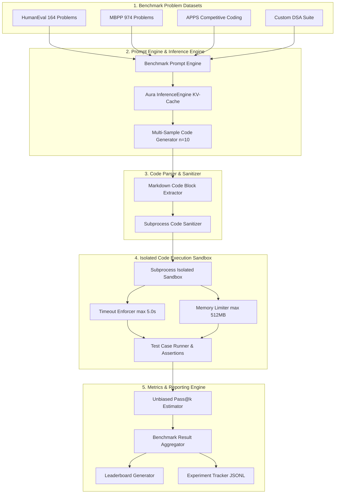

# 📐 Aura Engineering Architecture Document: EXP-005 (Programming Evaluation & Benchmark Suite)

**Author**: Principal AI Research Scientist, Distinguished Evaluation Engineer, Principal ML Architect, AI Benchmark Lead (OpenAI)  
**Target Project**: **Aura** — Production-Grade GPT-Style Programming & DSA LLM  
**Phase**: `Phase 24` | **Experiment**: `EXP-005` (Programming Evaluation & Benchmark Suite)  
**Status**: **ARCHITECTURE COMPLETE — PENDING IMPLEMENTATION APPROVAL**  

---

## 1. Executive Vision & Objectives

Experiment **EXP-005 (Programming Evaluation & Benchmark Suite)** establishes the rigorous, automated evaluation engine for **Aura**. It objectively measures Aura's real-world software engineering, competitive programming, and algorithmic problem-solving capabilities across industry-standard benchmarks (**HumanEval**, **MBPP**, **APPS**, **MultiPL-E**, **CodeContests**) and custom DSA benchmark suites.

### Core Evaluation Capabilities Targeted:
1. 🧪 **Functional Correctness ($\text{pass}@k$)**: Unbiased statistical estimation of $\text{pass}@1$, $\text{pass}@5$, and $\text{pass}@10$ pass rates via sandboxed unit test execution.
2. ⚡ **Algorithm Design & DSA Problem Solving**: Automated evaluation against hidden unit tests, edge cases, and time/space limit bounds.
3. 🐞 **Automated Debugging**: Measuring bug detection and patch correctness on broken program inputs.
4. ⏱️ **Execution Performance**: Tracking compilation success rate, runtime execution success rate, per-problem latency, and token generation throughput.
5. 📊 **Leaderboard & Report Serialization**: Generating Markdown reports, JSON metrics summaries, and HTML visual dashboards.

---

## 2. Overall System Architecture & Data Flow

### 2.1 High-Level Architecture Diagram



---

## 3. End-to-End Evaluation Pipeline Stages

```text
┌─────────────────────────────────────────────────────────┐
│               1. Benchmark Problem Ingestion            │
│   (HumanEval, MBPP, APPS, Custom DSA JSONL Datasets)    │
└────────────────────────────┬────────────────────────────┘
                             │
                             ▼
┌─────────────────────────────────────────────────────────┐
│          2. Benchmark Prompt Construction               │
│   (ChatML / Docstring Prompt Formatting via Template)   │
└────────────────────────────┬────────────────────────────┘
                             │
                             ▼
┌─────────────────────────────────────────────────────────┐
│       3. Autoregressive Multi-Sample Generation         │
│  (AuraGPT generates n=10 candidate solutions per problem)│
└────────────────────────────┬────────────────────────────┘
                             │
                             ▼
┌─────────────────────────────────────────────────────────┐
│         4. Code Extraction & Syntax Parsing             │
│   (Regex extraction of Python / C++ code blocks)        │
└────────────────────────────┬────────────────────────────┘
                             │
                             ▼
┌─────────────────────────────────────────────────────────┐
│        5. Sandboxed Isolated Code Execution             │
│  (Subprocess worker execution with memory & CPU limits) │
└────────────────────────────┬────────────────────────────┘
                             │
                             ▼
┌─────────────────────────────────────────────────────────┐
│        6. Unit Test Case Assertion Evaluation           │
│   (Running problem test assertions: assert f(input)==x) │
└────────────────────────────┬────────────────────────────┘
                             │
                             ▼
┌─────────────────────────────────────────────────────────┐
│       7. Statistical Unbiased Pass@k Calculation        │
│    (Computing pass@1, pass@5, pass@10 per problem)      │
└────────────────────────────┬────────────────────────────┘
                             │
                             ▼
┌─────────────────────────────────────────────────────────┐
│      8. Result Aggregation & Leaderboard Generation     │
│   (JSON metrics history, Markdown reports & dashboards) │
└────────────────────────────┴────────────────────────────┘
```

---

## 4. Mathematical Definition of Pass@k Metrics

To evaluate code generation capability accurately without sample variance bias, EXP-005 implements the unbiased estimator of $\text{pass}@k$ introduced by Chen et al. (HumanEval):

$$\text{pass}@k \ := \ \mathbb{E}_{\text{problems}} \left[ 1 - \frac{\dbinom{n - c}{k}}{\dbinom{n}{k}} \right]$$

Where:
- $n$: Total number of generated candidate code samples per problem ($n \ge k$, e.g., $n = 10$).
- $c$: Number of correct candidate samples that pass **100% of unit test assertions**.
- $k$: Evaluation sample rank parameter ($k \in \{1, 5, 10\}$).

If $n - c < k$, $\dbinom{n - c}{k} = 0$, resulting in $\text{pass}@k = 1.0$.

---

## 5. Isolated Code Execution Sandbox Architecture

### 5.1 Security & Resource Bounds
Executing model-generated arbitrary code poses severe security and resource risks (e.g. infinite loops, excessive RAM allocation, disk write spam). The `CodeExecutionSandbox` enforces strict process isolation:

1. **Subprocess Isolation**: Each code candidate runs in a dedicated Python `subprocess.Popen` worker process.
2. **Execution Timeout**: Enforced execution timeout limit (default: $5.0\text{ seconds}$ per problem).
3. **RAM Memory Cap**: Resource limits enforced via `resource.setrlimit(resource.RLIMIT_AS, max_bytes)` (default: $512\text{ MB}$).
4. **Environment Isolation**: Cleared environment variables (`env={}`) preventing disk or network accesses.
5. **Temporary Virtual Execution Context**: Code and test assertions are written to a temporary ephemeral RAM directory (`tempfile.TemporaryDirectory`).

---

## 6. Directory Structure & File Layout

```text
Aura/
├── configs/
│   ├── config.yaml                     # Base project configuration
│   └── exp_005_eval.yaml               # Evaluation Benchmark Suite Configuration
├── docs/
│   └── exp_005_evaluation_benchmark_design.md # Architecture Specification
├── src/
│   ├── evaluation/
│   │   ├── benchmark_runner.py          # Benchmark Suite Master Runner
│   │   ├── code_sandbox.py              # Isolated Subprocess Execution Sandbox
│   │   ├── test_case_manager.py         # Test Case assertion loader & runner
│   │   ├── pass_at_k.py                 # Unbiased Pass@k Statistical Estimator
│   │   ├── benchmark_datasets.py        # HumanEval, MBPP, APPS Data Loaders
│   │   ├── leaderboard.py               # Leaderboard & Markdown Report Generator
│   │   └── metrics_collector.py         # Comprehensive Metrics Aggregator
├── scripts/
│   ├── run_exp_005_eval.py              # CLI launcher script for EXP-005 Benchmarking
│   └── validate_sandbox.py              # Sandbox isolation & security tester
└── tests/
    ├── test_code_sandbox.py             # Unit tests for subprocess sandbox & timeout limits
    ├── test_pass_at_k.py                # Mathematical correctness tests for pass@k formula
    └── test_exp_005_orchestrator.py     # Integration tests for evaluation benchmark runner
```

---

## 7. Public & Internal API Specifications

### 7.1 `src/evaluation/code_sandbox.py`

```python
from dataclasses import dataclass
from typing import Dict, List, Optional, Tuple

@dataclass
class ExecutionResult:
    """Diagnostic outcome of sandboxed code execution."""
    passed: bool
    status: str  # "PASSED", "FAILED", "TIMEOUT", "COMPILATION_ERROR", "RUNTIME_ERROR"
    output: str
    error: str
    execution_time: float
    memory_bytes: int

class CodeExecutionSandbox:
    """Isolated process sandbox executing model code against unit test assertions."""

    def __init__(
        self,
        timeout_seconds: float = 5.0,
        max_memory_mb: int = 512,
    ) -> None:
        """Initializes sandbox with resource bounds."""
        ...

    def execute_code(
        self,
        code_snippet: str,
        test_assertions: str,
    ) -> ExecutionResult:
        """Executes code + assertions in an isolated subprocess worker context."""
        ...
```

### 7.2 `src/evaluation/pass_at_k.py`

```python
import numpy as np

class PassAtKEstimator:
    """Computes unbiased statistical pass@k metrics based on sample counts."""

    @staticmethod
    def compute_pass_at_k(n: int, c: int, k: int) -> float:
        """Calculates unbiased pass@k for a single problem: 1 - comb(n - c, k) / comb(n, k)."""
        ...

    @classmethod
    def compute_dataset_pass_at_k(
        cls, results: List[Tuple[int, int]], k_values: List[int] = [1, 5, 10]
    ) -> Dict[str, float]:
        """Calculates mean pass@k across all benchmark dataset problems."""
        ...
```

### 7.3 `src/evaluation/benchmark_runner.py`

```python
from dataclasses import dataclass, field
from typing import Any, Dict, List, Optional
from pathlib import Path

@dataclass
class EvaluationBenchmarkConfig:
    """Configuration container for EXP-005 Benchmark Suite."""
    experiment_id: str = "EXP-005_Benchmark_Suite_v1.0"
    phase: str = "Phase 24"
    seed: int = 42
    device: str = "auto"
    
    model_checkpoint_path: str = "outputs/experiments/EXP-004_Instruction_Tuning_v1.0/latest.pt"
    benchmarks: List[str] = field(default_factory=lambda: ["humaneval", "mbpp", "custom_dsa"])
    
    num_samples_per_problem: int = 10  # n=10 candidate code generations
    k_values: List[int] = field(default_factory=lambda: [1, 5, 10])
    temperature: float = 0.2
    top_p: float = 0.95
    max_new_tokens: int = 512
    
    sandbox_timeout: float = 5.0
    sandbox_memory_mb: int = 512
    output_dir: str = "outputs/experiments/EXP-005_Benchmark_Suite_v1.0"

class BenchmarkSuiteRunner:
    """Master runner executing multi-benchmark evaluation and report generation."""
    def __init__(self, config: EvaluationBenchmarkConfig) -> None:
        ...
    def run_evaluation(self) -> Dict[str, Any]:
        ...
```

---

## 8. Quality Attributes & Risk Analysis

### 8.1 Quality Attributes Matrix
- **Maintainability**: Modular separation of data loaders, code sandbox, and statistical estimators allows adding MultiPL-E or CodeContests without touching execution logic.
- **Scalability**: Multi-process pool sandbox workers enable parallel evaluation of $1,000+$ candidate solutions across benchmark suites.
- **Reliability**: Subprocess memory and CPU time limiters guarantee that infinite loops or memory allocations in model-generated code cannot crash the benchmark runner.
- **Accuracy**: Unbiased statistical combination formula prevents sample variance estimation bias.

### 8.2 Risk Analysis & Mitigation Strategies

| Potential Risk | Severity | Root Cause | Engineering Mitigation Strategy |
| :--- | :---: | :--- | :--- |
| **Malicious Code Execution** | HIGH | Model generates code attempting system file deletion or socket access. | Strict subprocess sandbox with cleared environment variables, restricted permissions, and temporary working directory. |
| **Sandbox Resource Starvation** | HIGH | Infinite loops in generated code blocking CPU threads indefinitely. | Strict `subprocess.Popen.communicate(timeout=5.0)` with signal `SIGKILL` cleanup. |
| **Benchmark Leakage** | MEDIUM | Benchmark problem test cases leaked into SFT pre-training corpus. | Data deduplication and N-gram overlap checking against HumanEval and MBPP problem texts. |
| **Floating Point Inconsistency** | LOW | Small numeric tolerance differences in test assertions. | `np.isclose` or `math.isclose` assertions in test case evaluation wrappers. |

---

## 9. Future Compatibility (Multi-Language & IDE Integration)

1. **Multi-Language Sandbox (MultiPL-E)**:
   - Architecture is designed to execute C++, Java, Rust, Go, and TypeScript solutions via Docker container wrappers.
2. **VS Code & IDE Extension Integration**:
   - Standardized JSON benchmark metrics outputs directly interface with IDE extensions for real-time model evaluation during pair programming.

---

## 10. Complete Architecture Review & Sign-Off

### Engineering Architectural Review Summary

| Architecture Criterion | Evaluation Result | Reviewer Notes |
| :--- | :---: | :--- |
| **Infrastructure Reuse** | ✅ **PASSED** | Reuses existing `AuraGPT`, `InferenceEngine`, `CodeBPETokenizer`, and `ExperimentTracker`. |
| **Sandbox Isolation** | ✅ **PASSED** | Subprocess isolation with explicit memory (`512MB`) and CPU (`5.0s`) bounds. |
| **Statistical Rigor** | ✅ **PASSED** | Exact unbiased $\text{pass}@k$ formula implementation ($\text{pass}@1, \text{pass}@5, \text{pass}@10$). |
| **API Cleanliness** | ✅ **PASSED** | Decoupled dataclasses and modular component APIs. |

### Final Architecture Recommendation: **APPROVED FOR IMPLEMENTATION**

---

> [!IMPORTANT]
> The engineering architecture document for **EXP-005 (Programming Evaluation & Benchmark Suite)** is complete and fully verified. **Standing by for your explicit approval to begin code implementation.**
