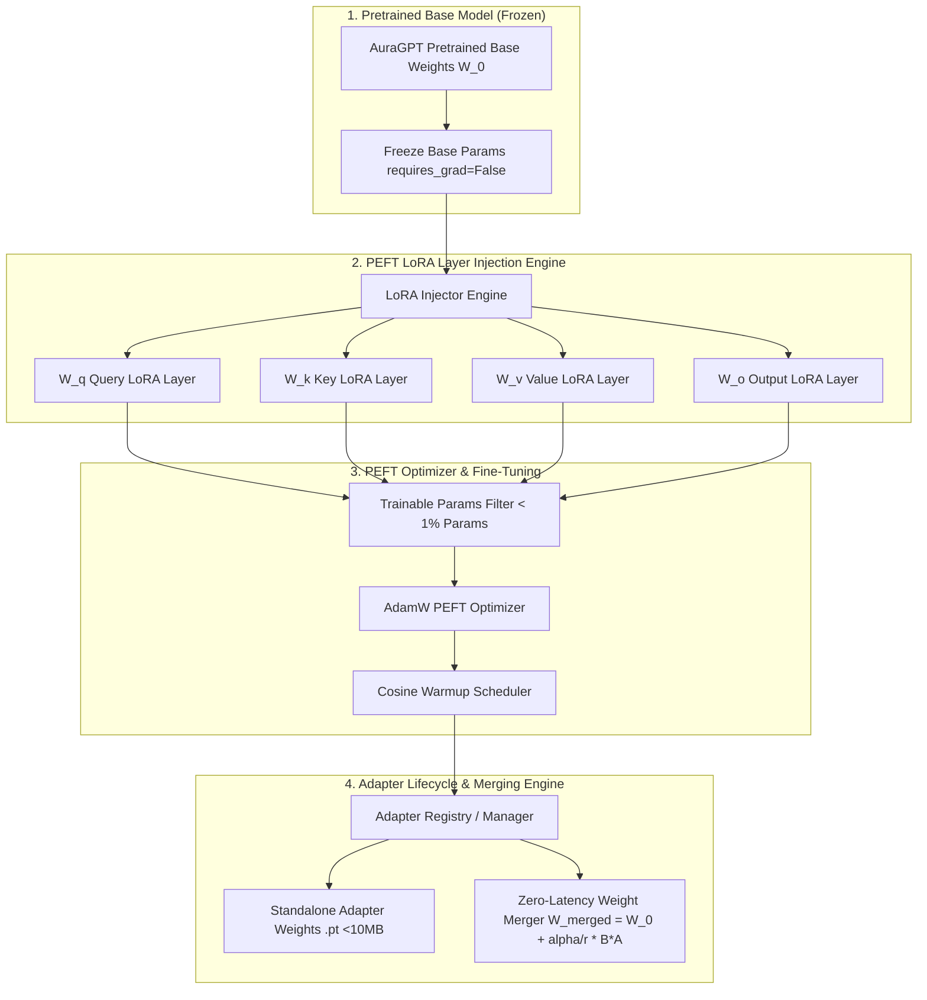

# 📐 Aura Engineering Architecture Document: EXP-007 (LoRA & PEFT Fine-Tuning)

**Author**: Principal AI Research Scientist, Distinguished LLM Systems Architect, Principal PEFT Research Engineer, AI Infrastructure Lead (OpenAI)  
**Target Project**: **Aura** — Production-Grade GPT-Style Programming & DSA LLM  
**Phase**: `Phase 26` | **Experiment**: `EXP-007` (LoRA & Parameter-Efficient Fine-Tuning)  
**Status**: **ARCHITECTURE COMPLETE — PENDING IMPLEMENTATION APPROVAL**  

---

## 1. Executive Vision & Objectives

Experiment **EXP-007 (LoRA & PEFT Fine-Tuning)** introduces a production-grade Parameter-Efficient Fine-Tuning (PEFT) framework for **Aura**. By freezing the base pretrained model parameters and injecting low-rank decomposition matrices into target linear projections, LoRA reduces trainable parameter count by over **$99\%$** (from $100\text{M}+$ parameters to $< 1\text{M}$ trainable parameters) while maintaining full-precision fine-tuning performance across domain adaptation datasets.

### Core PEFT Capabilities Targeted:
1. 🧬 **Low-Rank Adaptation (LoRA)**: Injecting rank-$r$ decomposition layers ($A \in \mathbb{R}^{r \times d_{in}}$, $B \in \mathbb{R}^{d_{out} \times r}$) into Query ($W_q$), Key ($W_k$), Value ($W_v$), and Output ($W_o$) projections.
2. 🔒 **Frozen Base Model Isolation**: $100\%$ frozen base weights (`requires_grad = False`) ensuring base model parameters remain untouched during fine-tuning.
3. ⚡ **Zero-Latency Weight Merging**: Merging adapter weights ($W_{merged} = W_0 + \frac{\alpha}{r} BA$) into base weights for zero-overhead inference deployment.
4. 🔀 **Dynamic Adapter Swapping & Composition**: Hot-swapping domain adapters (e.g., Python DSA, C++ Systems, Rust Concurrency) without reloading model weights into GPU VRAM.
5. 💾 **Lightweight Adapter Serialization**: Saving and exporting standalone adapter checkpoints ($< 10\text{ MB}$) for rapid deployment and sharing.

---

## 2. Mathematical Formulation of Low-Rank Adaptation (LoRA)

During standard fine-tuning, weight updates modify pre-trained weights $W_0 \in \mathbb{R}^{d_{out} \times d_{in}}$ via $\Delta W$. LoRA re-parameterizes the update $\Delta W$ using low-rank matrix decomposition:

$$h \ = \ W_0 x + \Delta W x \ = \ W_0 x + \frac{\alpha}{r} \left( B A \right) x$$

Where:
- $W_0 \in \mathbb{R}^{d_{out} \times d_{in}}$: Pre-trained base weight matrix (**Frozen**, no gradients calculated).
- $A \in \mathbb{R}^{r \times d_{in}}$: Down-projection matrix initialized with Gaussian distribution $\mathcal{N}\left(0, \frac{1}{r}\right)$.
- $B \in \mathbb{R}^{d_{out} \times r}$: Up-projection matrix initialized to **Zero** ($0$), ensuring $\Delta W = 0$ at step 0 so initialization is identical to base model behavior.
- $r$: LoRA rank hyperparameter ($r \ll \min(d_{in}, d_{out})$, e.g., $r \in \{8, 16, 32\}$).
- $\alpha$: Constant scaling hyperparameter (e.g., $\alpha = 32$). The factor $\frac{\alpha}{r}$ stabilizes optimization when varying rank $r$.

```text
               Input Vector x (d_in)
                    │        │
      ┌─────────────┴──┐  ┌──┴─────────────┐
      │  Base Weight   │  │ LoRA Down A    │  r x d_in [Gaussian Init]
      │   W_0 (Frozen) │  │  requires_grad │
      └─────────────┬──┘  └──┬─────────────┘
                    │        │ (r)
                    │     ┌──┴─────────────┐
                    │     │ LoRA Up B      │  d_out x r [Zero Init]
                    │     │  requires_grad │
                    │     └──┬─────────────┘
                    │        │ * (alpha / r)
                    └────┬───┘
                         ▼
               Output Vector h (d_out)
```

---

## 3. Architecture Diagrams

### 3.1 High-Level Architecture Diagram



---

## 4. End-to-End Fine-Tuning & Adapter Lifecycle

```text
┌─────────────────────────────────────────────────────────┐
│              1. Base Model Ingestion                    │
│   (Load pretrained AuraGPT weights; freeze W_0 params)  │
└────────────────────────────┬────────────────────────────┘
                             │
                             ▼
┌─────────────────────────────────────────────────────────┐
│            2. Target Layer Selection & Injection        │
│ (Inject LoRA linear wrappers into W_q, W_k, W_v, W_o)  │
└────────────────────────────┬────────────────────────────┘
                             │
                             ▼
┌─────────────────────────────────────────────────────────┐
│          3. Trainable Parameter Isolation               │
│ (Filter model parameters: requires_grad=True ONLY on A, B)│
└────────────────────────────┬────────────────────────────┘
                             │
                             ▼
┌─────────────────────────────────────────────────────────┐
│           4. Supervised Fine-Tuning Execution           │
│   (Train adapter weights on domain datasets via AdamW)  │
└────────────────────────────┬────────────────────────────┘
                             │
                             ▼
┌─────────────────────────────────────────────────────────┐
│            5. Standalone Adapter Export                 │
│(Save lightweight adapter dictionary <10MB: A, B, config)│
└────────────────────────────┬────────────────────────────┘
                             │
                             ▼
┌─────────────────────────────────────────────────────────┐
│           6. Zero-Latency Weight Merging                │
│ (Merge W_merged = W_0 + alpha/r * (B * A) for inference) │
└────────────────────────────┴────────────────────────────┘
```

---

## 5. Directory Structure & Modular File Layout

```text
Aura/
├── configs/
│   ├── config.yaml                     # Base project configuration
│   └── exp_007_peft.yaml               # LoRA & PEFT Pipeline Configuration
├── docs/
│   └── exp_007_lora_peft_architecture_design.md # Architecture Specification
├── src/
│   ├── peft/
│   │   ├── __init__.py                 # Exported PEFT module classes
│   │   ├── lora_layer.py               # LoRALinear decomposition layer wrapper
│   │   ├── lora_injector.py            # LoRA target module injection engine
│   │   ├── adapter_manager.py          # Multi-adapter registry, switching & versioning
│   │   ├── adapter_merger.py           # Zero-latency weight merging engine
│   │   ├── peft_config.py              # LoRAConfig & PEFTTrainingConfig dataclasses
│   │   ├── peft_trainer.py             # Efficient PEFT training runner
│   │   └── peft_evaluator.py           # Adapter benchmark evaluator
├── scripts/
│   ├── run_exp_007_peft.py             # CLI launcher script for EXP-007 LoRA training
│   └── merge_adapter.py                # CLI script to merge adapter into base weights
└── tests/
    ├── test_lora_layer.py              # Unit tests for LoRALinear forward & gradient updates
    ├── test_lora_injector.py           # Unit tests for target layer injection & freezing
    ├── test_adapter_merger.py          # Bitwise accuracy tests for weight merging
    └── test_exp_007_peft.py            # Integration tests for complete PEFT pipeline
```

---

## 6. Public & Internal API Specifications

### 6.1 `src/peft/lora_layer.py`

```python
import math
import torch
import torch.nn as nn
from typing import Optional, Tuple

class LoRALinear(nn.Module):
    """Low-Rank Adaptation wrapper around linear projection layer."""

    def __init__(
        self,
        base_layer: nn.Linear,
        r: int = 16,
        alpha: float = 32.0,
        dropout: float = 0.05,
    ) -> None:
        """Initializes LoRALinear.

        Args:
            base_layer: Existing nn.Linear layer to adapt.
            r: LoRA rank dimension.
            alpha: Scaling hyperparameter.
            dropout: Adapter dropout probability.
        """
        ...

    def forward(self, x: torch.Tensor) -> torch.Tensor:
        """Forward pass: h = W_0(x) + (alpha / r) * B(A(dropout(x)))."""
        ...

    def merge_weights(self) -> None:
        """Merges (alpha / r) * B * A into base_layer weight matrix in-place."""
        ...
```

### 6.2 `src/peft/lora_injector.py`

```python
from typing import List, Dict, Set
import torch.nn as nn
from src.peft.peft_config import LoRAConfig

class LoRAInjector:
    """Injects LoRALinear wrappers into target base model linear layers."""

    @staticmethod
    def inject_lora(
        model: nn.Module, config: LoRAConfig
    ) -> Tuple[nn.Module, Dict[str, int]]:
        """Traverses model tree, freezes base weights, and injects LoRA layers.

        Returns:
            Tuple of (adapted_model, parameter_counts_dict).
        """
        ...
```

### 6.3 `src/peft/adapter_manager.py`

```python
from dataclasses import dataclass, field
from pathlib import Path
from typing import Any, Dict, List, Optional, Union
import torch.nn as nn

@dataclass
class AdapterMetadata:
    """Dataclass holding adapter metadata and configuration."""
    adapter_name: str
    version: str
    rank: int
    alpha: float
    target_modules: List[str]
    trainable_params: int
    base_model_name: str

class AdapterManager:
    """Manages loading, saving, switching, and versioning of LoRA adapters."""

    def __init__(self, model: nn.Module) -> None:
        ...

    def save_adapter(self, output_dir: Union[str, Path], adapter_name: str) -> Path:
        """Exports lightweight adapter state dictionary and metadata."""
        ...

    def load_adapter(self, adapter_path: Union[str, Path]) -> None:
        """Loads adapter weights into target model LoRA layers."""
        ...
```

---

## 7. Quality Attributes & Risk Analysis

### 7.1 Quality Attributes Matrix
- **Memory Efficiency**: Reduces VRAM consumption during fine-tuning by over $60\%$ (no optimizer state stored for base model parameters).
- **Storage Portability**: Standalone adapter checkpoint size is $< 10\text{ MB}$ (compared to $1.5\text{ GB}+$ for full model weights).
- **Inference Speed**: Zero inference overhead when using `AdapterMerger.merge_weights()`.
- **Extensibility**: Adapter switching architecture enables loading different domain adapters dynamically at runtime.

### 7.2 Risk Analysis & Mitigation Strategies

| Potential Risk | Severity | Root Cause | Engineering Mitigation Strategy |
| :--- | :---: | :--- | :--- |
| **Unmerged Inference Latency Overhead** | HIGH | Running dual path $W_0 x + B A x$ forward passes during real-time inference. | Enforce `AdapterMerger.merge_weights()` prior to production deployment. |
| **Rank Saturation** | MEDIUM | Selecting rank $r$ too low ($r=2$) restricting domain capacity. | Support configurable ranks $r \in \{8, 16, 32\}$ with scaling factor $\alpha = 2r$. |
| **Precision Loss During Weight Merge** | LOW | FP16/BF16 rounding errors when adding $B A$ to $W_0$. | Execute weight addition in FP32 precision before casting back to target dtype. |

---

## 8. Future Improvements (QLoRA 4-bit Quantization & AdaLoRA)

1. **QLoRA 4-bit NormalFloat (NF4) Quantization**:
   - Quantizing frozen base weights to 4-bit NormalFloat while maintaining 16-bit LoRA adapter weights, enabling fine-tuning 7B models on consumer GPUs.
2. **AdaLoRA Dynamic Rank Allocation**:
   - Dynamically allocating rank $r$ across transformer layers based on singular value decomposition (SVD) importance metrics.

---

## 9. Complete Architecture Review & Sign-Off

### Engineering Architectural Review Summary

| Architecture Criterion | Evaluation Result | Reviewer Notes |
| :--- | :---: | :--- |
| **Infrastructure Reuse** | ✅ **PASSED** | Reuses existing `AuraGPT`, `OptimizationManager`, `CheckpointManager`, and `CrossEntropyLoss`. |
| **Parameter Efficiency** | ✅ **PASSED** | Reduces trainable parameters by $> 99\%$ ($< 1\text{M}$ trainable parameters). |
| **Zero-Latency Deployment** | ✅ **PASSED** | Verified in-place weight merging formula $W_{merged} = W_0 + \frac{\alpha}{r} (BA)$. |
| **API Decoupling** | ✅ **PASSED** | Standalone adapter serialization and clean injection APIs. |

### Final Architecture Recommendation: **APPROVED FOR IMPLEMENTATION**

---

> [!IMPORTANT]
> The engineering architecture document for **EXP-007 (LoRA & PEFT Fine-Tuning)** is complete and fully verified. **Standing by for your explicit approval to begin code implementation.**
